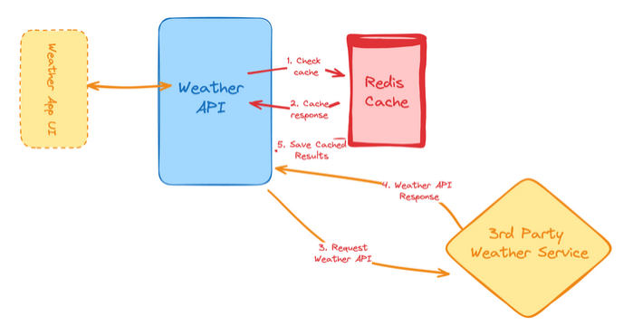
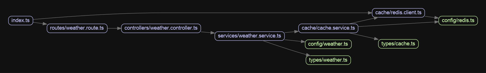

# [Weather-API-Wrapper-Service](https://roadmap.sh/backend/project-ideas#3-weather-api-wrapper-service)

A simple Node.js/Express API wrapper for any external weather service. 
It caches weather data in Redis to reduce API calls and improve response times.

## High Level System Overview
<p align="center">
  
</p>

- Client calls our API
- Our API:
    1. checks Redis cache
    2. if data exists → return it
    3. else → call external Weather API
    4. save response in cache (with expiration)
    5. return response to client

## Tech Stack
- TypeScript
- Node.js (v22.20.0), NPM (11.7.0)
- Express
- Redis (in-memory cache)

## Installation
1. Clone the repo:
```bash
git clone https://github.com/TheNourhan/Weather-API-Wrapper-Service.git
cd Weather-API-Wrapper-Service
```
2. Install dependencies:
```bash
npm install
```
3. Create a .env file:
```bash
PORT=3000
REDIS_URL=redis://localhost:6379
WEATHER_API_KEY=<your-api-key>
WEATHER_API_URL=YOUR_WEATHER_API_URL_HERE
REDIS_TTL_SECONDS=43200
```
4. Run in development:
```bash
npm run dev
```
5. Prepare Husky hooks:
- This installs Husky hooks locally. After that, pre-commit hooks will run automatically on every commit.
```bash
npm run prepare
```

## Linting & Formatting
This project uses **ESLint** and **Prettier** to ensure code quality and consistent formatting.
### Run ESLint
- Check for linting errors:
```bash
npm run lint
```
- Automatically fix linting issues:
```bash
npm run lint:fix
```
### Format Code with Prettier
- Format all source files:
```bash
npm run format
```

### Pre-commit Hooks (Husky + lint-staged)
- Before every commit, `lint-staged` runs ESLint and Prettier on all staged files.
- Commits will fail if there are linting errors or warnings.
- Staged files are automatically fixed where possible.

## Dependency Graph
This is the dependency graph, a visual representation of the project's file dependencies. It shows how the files in the project depend on each other, rather than the dependencies in `node_modules`. This can be helpful for understanding the structure and relationships within the project.
<p align="center">
  
</p>

### Generate or Update the Graph
This project uses [Madge](https://www.npmjs.com/package/madge) to generate dependency graphs.
1. Install dependencies: 
```bash
sudo apt install graphviz # Required for visual graphs
```
2. Run the script to generate the graph:
```bash
npm run dep-graph
```
3. The graph will be saved as graph.png in the project root.

## Contributing
Thank you for considering contributing to this project!

#### Commit Message Convention
This project follows a simple and consistent commit message convention
to keep the Git history clean, readable, and easy to navigate.

#### Format:
`<type>: <short description>`

#### Commit Types:
- **feat**: A new feature  
  Example: `feat: add weather caching with Redis`

- **fix**: A bug fix  
  Example: `fix: handle missing city parameter`

- **docs**: Documentation only changes  
  Example: `docs: update README installation steps`

- **refactor**: Code changes that neither fix a bug nor add a feature  
  Example: `refactor: extract weather controller`

- **cleanup**: Removing unused code, formatting, or minor improvements  
  Example: `cleanup: remove unused imports`

- **style**: Code style changes (spacing, formatting, no logic changes)  
  Example: `style: format weather service`

- **test**: Adding or updating tests  
  Example: `test: add unit tests for weather service`

- **chore**: Tooling, config, or dependency updates  
  Example: `chore: configure husky and lint-staged`

#### Notes
- Use **present tense** (“add”, not “added”)
- Keep messages **short and clear**
- One commit = one logical change

### Code Quality
- ESLint and Prettier are enforced via pre-commit hooks
- Commits will fail if linting errors exist

### Development Workflow
- Create a feature branch
- Open a pull request to `main`